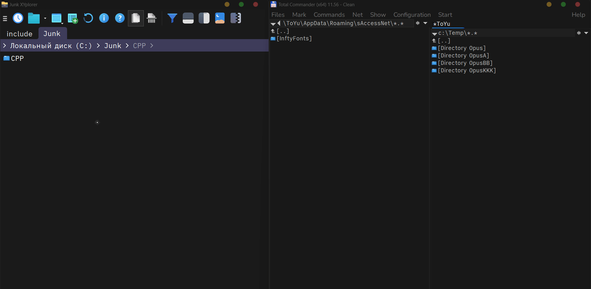
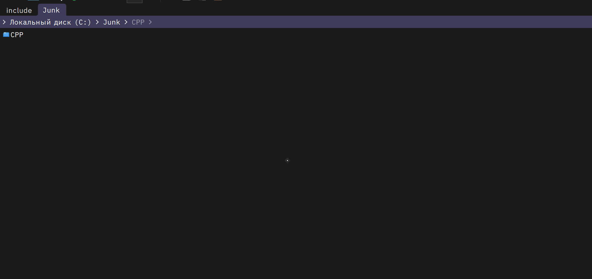

<div align="center">    
<a href="#installation">
</a><br>
<a href="#installation">
</a>
<!--
<a href="https://wingetgui.com/apps/JoyHak-QuickSwitch">
</a>
<a href="https://push.chocolatey.org/packages/quickswitch">
</a>
-->
<br>
<a href="https://github.com/JoyHak/QuickSwitch/discussions/new/choose">
</a>
<a href="https://github.com/JoyHak/QuickSwitch/issues/new?template=bug-report.yaml">
</a>
</div>

Imagine you want to open/save a file. A dialog box will appear and you will need to manually search for the target folder. QuickSwitch can open it instantly:


Open any tabs in supported file managers: Windows Explorer, [Directory Opus](https://resource.dopus.com/t/quickswitch/40965/20), [Total Commander](https://www.ghisler.ch/board/viewtopic.php?t=76254&sd=d), [XYplorer](https://www.xyplorer.com/xyfc/viewtopic.php?t=28304&sd=d). All opened tabs will be available in the Menu for switching, press `Ctrl+Q` to open the Menu. [Pin and save your favorite paths](#menu-sections) and [open them later](#enforce-menu) in any file manager or application.

Enable ["AutoSwitch" option](#file-dialogs) to automatically change path in file dialog:


And of course you can customize the Menu:<br>


Now you can install QuickSwitch or [explore](#appearance) advanced customization options!

## Installation

<a href="https://github.com/JoyHak/QuickSwitch/releases/latest">
</a>
<a href="https://github.com/JoyHak/QuickSwitch/releases/latest">
</a>
<br><br>

<!--
UNDER VERIFICATION.
You can install and upgrade QuickSwitch automatically through package manager or [download it manually](#manual-installation).

```ahk
winget install JoyHak.QuickSwitch
```

<details>
  <summary>
    <a name="winget" href="https://learn.microsoft.com/en-us/windows/package-manager">
      winget
    </a>
  </summary>

```powershell
winget install JoyHak.QuickSwitch
winget upgrade JoyHak.QuickSwitch
```

</details>

<details>
  <summary>
    <a name="chocolatey" href="https://docs.chocolatey.org/en-us/why">
      chocolatey
    </a>
  </summary>

```powershell
choco install quickswitch
choco upgrade quickswitch
```

</details>

<details>
  <summary>
    <a name="scoop" href="https://github.com/ScoopInstaller/Scoop/wiki/So-What">
      scoop
    </a>
  </summary>

```powershell
scoop bucket add extras
scoop install quickswitch
scoop update quickswitch
```

</details>

After installation press `Win+R` or `Win+Q`, type `QuickSwitch` and press `Enter` to launch installed package.

### Manual installation
-->

1. [Download](https://github.com/JoyHak/QuickSwitch/releases/latest) the latest x64 or x32 archive depending on your system architecture. If you don't know it, start with the x64 version. *It is not recommended to run the x32 version on an x64 machine!*
2. Create a directory named `QuickSwitch`, copy downloaded archive here and select "extract here" from the context menu. Follow the same steps to update the app. The `.ini` configuration will never be replaced. 
3. Run `QuickSwitch.exe`. Open some tabs in a supported file manager or create `.lnk` files in `.\Favorites`.
4. Open any application and try to open\save a file using it. E.g., open `Notepad` then `File - Open...` (or press `Ctrl+Shift+S`).
5. Press `Ctrl+Q` and look at the paths in the Menu that opens. All directories opened in supported file managers will be displayed here.
6. Explore the available options in the _"Settings"_ and experiment with them. Choose a convenient style and logic of the menu!


## Appearance

### Menu sections

In addition to the paths from the file managers, you can enable special paths on `Settings > Theme` tab.


#### Pinned

<details><summary>Pinned paths (that are always visible)</summary>

If you want some paths to appear permanently in the Menu, you can pin them. To do this, enable the `Settings > Theme > Show pinned paths`  option and [select a key or mouse button](#keyboard) on  `Settings > App > Pin path...`. Close the settings and open the Menu. Hold down the selected key and left click on any path. Now it is pinned and it will be stored in the configuration. You will see this path on every restart. 

If you turn this option *off*, the pinned paths will no longer be displayed. If you turn this option *on* again, all pinned paths will be displayed again. If you want to delete all pinned paths, check `Settings > Reset > Delete favorite paths` and press `Enter`.

If you want to see the duplicate paths disable the `Settings > Menu > Delete duplicate paths` option *(e.g. if you have a pinned path, but also want to quickly find it visually in the Menu by file manager icon)*.

</details>


#### Clipboard

<details><summary>Paths from clipboard (temporary, for a single file dialog)</summary>

You can copy any file or directory path (or any [variable](#variables)) and it will appear in the Menu. All copied paths will remain in the Menu until you open the file dialog in another application. If you want some paths to appear permanently, pin them.


Copied paths will not disappear if you enforce the Menu to appear using [`Ctrl+Shift+Win+0`](#enforce-menu). It can help you to open the copied paths in multiple applications. If you copy the path to a file, QuickSwitch will use the directory with that file by removing everything after the last slash `\`.

The option works in the background and analyzes the clipboard for the presence of a path when changing it. If several paths separated by line breaks (multi-line text) have been copied, they will be added to the Menu individually. 


Background analysis is temporarily disabled when requesting paths from other file managers *(if the `Settings > Theme > (Show) file managers paths` option is enabled)*, as their data is exchanged via the clipboard. If the request takes a very long time *(e.g., QuickSwitch creates the configuration for Total Commander)*, clipboard analysis will be turned off until all paths are fully received.

</details>


#### Favorites

<details><summary>Favorite paths (with customizable icons and names)</summary>

If you have many paths and you want to change how they are displayed in the Menu, enable the `Settings > Theme > Show favorite paths` option. This option works with `.lnk` shortcuts (links). In the input field next to it, enter the directory from which the shortcuts will be taken. You can use [variables](#variables).

Press `Enter` and open specified directory. [Create .lnk shortcut](https://www.thewindowsclub.com/create-desktop-shortcut-windows-10) to any directory or file. If the shortcut points to a file, its location will be shown in the Menu. Right click on created shortcut, select "properties" and click on the "shortcut" tab. 


You will see editable fields that will directly affect the display of the shortcut in QuickSwitch:

- Target
- Start in (working dir.)
- Comment
- Change icon (button)

The "target" field is the main path you will see. The "start in" field will only be used if the "target" field is empty. Even if the "target" points to a file, QuickSwitch will use the file directory by removing everything after the last slash `\`. You can change the displayed path and give it any name you want in the "comment" field. This field takes precedence over displaying the full or short path (`Settings > Short path`). All fields support [variables](#variables).

Let's put the `ScriptName` variable in the "comment" field. The Menu will show the internal QuickSwitch name for the shortcut named "MyFavoritePath". 


If you leave the "comment" field empty, the Menu will show the `Temp` variable value from "target" field (e.g. path to `C:\Temp`).

You can put the path to ICO, CUR, ANI, EXE, DLL, CPL, SCR and other resource that contains icons. For example I chose the system icon "shutdown" from `shell32.dll`, however I could choose ICO from the "Icons" folder. You can create as many shortcuts as you like and customize each one.


If you have many shortcuts, you can give them names (e.g. "MyFavoritePath") that will not be visible in the Menu and arrange them in directories. Regardless of the directory structure of your favorite paths, QuickSwitch will display all `.lnk` files from all directories. 


You can hide some shortcuts by changing or removing their extension. If there are a lot of shortcuts and you don't need them anymore, check `Settings > Reset > Delete favorite paths`. After pressing the `Enter` button, your shortcuts will be placed in the trash. You will be able to restore them before emptying the trash can.

</details>


#### File Managers

<details><summary>Tabs and entire panes from supported file managers</summary>

The main paths that you will see immediately after installation are sourced from one of the supported file managers. You can "filter" the visible paths using options on `Settings >  theme` tab. All these options can be combined to produce different "filter". Currently, they are global and are not bound to each file dialog individually.

- **Active pane:** many file managers, with the exception of Windows Explorer, have one or more panes. If you have many tabs open in each pane, you can choose to display only the tabs in the active pane. If "Active Tab" option is checked, "Active Pane" option would be ignored. That's it, the active tab will be the first one from each manager regardless of this option.

- **Active tab:** only the active tab from each manager will be displayed. If the adjacent "Show locked tabs" is checked and all tabs from the active pane of some manager are locked, paths from it not be displayed.

- **Locked Tabs:** in XYplorer and Total Commander, you can lock a tab's address. Once this is done, its path cannot be changed. Such tabs are sometimes referred to as "pinned" tabs. If you do not want them to be displayed, disable this option.

- **Z-order index:** If you've seen the windows when pressing `Alt+Tab`, you've noticed that they appear in order of most recent use (Z-order).

```
┌─────────────────────────────────────┐
│  Top of Z-Order (Foreground)
│  ┌─────────────────────────────────┐
│  │ Window 1 (Active, On Top)
│  └─────────────────────────────────┘
│  ┌──────────────────────┐
│  │ Window 2 (Middle)
│  └──────────────────────┘
│  ┌──────────────────────┐
│  │ Window 3 (Behind)
│  └──────────────────────┘
│  Bottom of Z-Order (Background)
└─────────────────────────────────────┘
```

By default it's set to **0** - all windows. The most recently opened window will be first (index **1**). Each open file manager window has a sequence number (index), and you can set it to display paths from that window only. So the last opened window has index **1**, recently opened has **2**, and so on. So Z-order index **2** means "display tabs from previous active window" (not the active one).

  

QuickSwitch counts index individually for each file manager. Therefore, if you have, for example, 2 XYplorer windows, you can set Z-order index to **1** or **2** even if there are other windows in-between. Windows from other apps are ignored.

```
┌─────────────────────────────────────┐
│  ┌─────────────────────────────────┐
│  │ XYplorer 1 (Active)
│  └─────────────────────────────────┘
│  ┌──────────────────────┐
│  │ Window 1 (Middle)
│  └──────────────────────┘
│  ┌──────────────────────┐
│  │ XYplorer 2 (Recent)
│  └──────────────────────┘
│  ┌──────────────────────┐
│  │ DOpus 1 (Recent)
│  └──────────────────────┘
│  ┌──────────────────────┐
│  │ DOpus 2 (Old)
│  └──────────────────────┘
└─────────────────────────────────────┘
```

- **Virtual desktops:** displays all paths from all file managers if the *Z-index* is `0` *(see above)* or displays the paths from lister according to the selected *Z-index*. If you recently opened a file manager on another desktop, select index `2` to see its paths.

  

</details>

### Short path

Any path can be shortened to a specified number of directories with limited name length: `System32\Resources` or even `Sys..\Res..`. The path shortening settings on `Settings > Short Path‬` tab allows you to completely change a path structure.

<details><summary>Short path examples</summary>

For example, enter number `2` in the `Number of dirs` field on the `ShortPath` tab. If the path to the menu will contain more than 2 directories (`C:\Windows\System32\Resources`), it will be shortened to 2 directories: `System32\Resources`

By default `ShortPath` cuts the beginning of the path. `Shorten the end` option cuts the end of the path.

Enter number `3` in the `Length of dir names` field on the same tab to limit the length of each directory in the path to 3 symbols: `Sys..\Res..`. Increase this number to see their full names.

Also you can include the disk letter at the beginning or change the separator between directories to anything, e.g. tilda `~`: `W:~Windows~System32`

</details>

## Settings

### Enforce Menu

You can show the Menu everywhere:

- Press default shortcut `Ctrl+Shift+Win+0` (can be changed on `Settings > App` tab). 
- Click on tray icon
- Right click on tray icon -> "Menu"

This shortcut can be changed to any [mouse button](#mouse) or [keyboard shortcut](#keyboard) or even special key like `CapsLock`. You can use this feature to open new tab in file manager or change working path in active application.

<details><summary>How to use this feature</summary>

This feature is known as "enforce menu" because it forces the menu to appear in any work application or file manager, even if there is no file dialog.

To understand how this works, let's look at an example. I opened `C:/Junk/CPP` tab in XYplorer and switched to Total Commander. Clicking the icon in the system tray or pressing the `Ctrl+Shift+Win+0` keyboard shortcut (can be changed on `Settings > App` tab) brought up the Menu showing my [pinned paths](#pinned) and the tab from XYplorer. Now, by selecting any path, I can switch the active tab in Total Commander.



It allows me to duplicate paths between file managers, [open bookmarks](#favorites) or recently [copied paths](#clipboard). You can customize your bookmarks and then open them in any file manager. And for active work, you can copy paths (for example, the path to the active tab or the path to a file) and open them all at once using "enforce menu" feature.

As this folder contains my C++ projects, let's open the IDE. Once the menu appears, I can select this path to open all my files. 



This way, I can open different projects, and their locations will be stored in QuickSwitch. I can open the same project in Clion, VS Code and Notepad++.

</details>

The menu will display the paths obtained after the last opening of the file dialog and will not change them until the next opening. The menu will be empty the first time it is opened. [Pin and save your favorite paths](#menu-sections) so you can always see them.

### File Dialogs

On `Settings > Menu` tab, you can configure the Menu's behavior for all file dialogs. For example, select *"(Show menu) always"* so that the Menu opens automatically in every file dialog. There are two options that are specific to each dialog.


#### Auto Switch

QuickSwitch can work without Menu in "AutoSwitch" mode. In this mode, the path changes immediately when the focus moves to the file dialog. You can switch between the open file dialog and the file manager to quickly open file paths. To activate this mode, open the Menu by pressing `Ctrl+Q` and select "AutoSwitch" (or press `A`). To enable it for all dialogs, open `Settings > Menu` tab, and select "Always Auto Switch".


<details><summary>Configure AutoSwitch</summary>

AutoSwitch switches to the 1st path found from the active file manager:

```
┌----------------------------┐
│  ┌----------------------┐
│  │ Window 1
│  └----------------------┘
│  ┌----------------------┐
│  │ Explorer  <--
│  └----------------------┘
│  ┌----------------------┐
│  │ Window 2
│  └----------------------┘
│  ┌----------------------┐
│  │ XYplorer
│  └----------------------┘
└----------------------------┘
```

To change this behavior, you can modify the path index and the [menu section](#menu-sections). The combination of the index and the section (**the source** from which to retrieve the path) allows for flexible use of AutoSwitch. For example, if file managers are closed, it may activate the *copied path*. And if there is a *pinned path*, always activate it. To understand what a **menu section** is, let's look at some examples.

```
AutoSwitch [index of the path] path from [menu section]
```

The simplest option is the `MenuStack` section: switch to the *1st path* visible in the menu. For example, for `ManagersPaths`, an *index 1* means "switch to tab #1, counting from the left". For `PinnedPaths`, the index means “switch to pinned path #1, counting from the top". For all sections except `ManagersPaths`, the path is counted from the top. You can switch between sections on the adjacent `theme`tab.

Depending on which sections are enabled, selecting the `MenuStack` section will switch to the first path in the menu. So, if paths are pinned, the switch will occur to the first (or selected) path:

```
Menu stack (pinned paths on top)
┌----------------------------┐
│ Pinned paths
│  ┌----------------------┐
│  📎 Pinned path 1 <--
│  └----------------------┘
│ Managers paths
│  ┌----------------------┐
│  📰 Explorer path 1
│  └----------------------┘
│  ┌----------------------┐
│  📰 Explorer path 2
│  └----------------------┘
└----------------------------┘
```

And if there are no pinned paths, but there are paths from file managers, the path that was found will be activated:

```
Menu stack (found paths on top)
┌---------------------------┐
│ Managers paths
│  ┌----------------------┐
│  📰 Explorer path 1 <--
│  └----------------------┘
│  ┌----------------------┐
│  📰 Explorer path 2
│  └----------------------┘
│ Clipboard paths
│  ┌----------------------┐
│  📋 Clipboard path 1
│  └----------------------┘
│  ┌----------------------┐
│  📋 Clipboard path 2
│  └----------------------┘
└----------------------------┘
```

You cannot switch to a path from an empty section (for example, you cannot activate a copied path if it isn't in the menu). You can select `MenuStack` to activate the **first path found in the menu**. This is the most dynamic section, because AutoSwitch can activate different path depending on a situation. The most predictable section is the `PinnedPaths`. If you've pinned a path and don't change it, AutoSwitch will always activate only that path.

Options on `Settings > Menu` tab does not conflict with AutoSwitch: first, the path will switch automatically, and then a menu will open.

To expand the power of "Auto Switch," [select the Z-order](#file-managers) index on the `theme` tab.

</details>


#### Black List

If you don't want to see the Menu or AutoSwitch in the current file dialog, open the menu and select "BlackList" (or press `B`). The Menu will still be accessible via `Ctrl+Q` and through tray icon.

<details><summary>Black List all dialogs of specific app</summary>

If you want to prevent the menu from appearing in all file dialogs of the current application (for example, when *opening or saving* a Word document), open the `Settings > Menu` tab and select "Add file dialog owner process name to Black List". After that, every time you click "Black List the Menu will not appear in all dialogs from this application and AutoSwitch mode will not be activated.

```
┌-------------------------------------┐
│ Word                           - o x
│  ┌---------┐
│  │ Save as │ Exclude
│  └---------┘
│  ┌---------┐
│  │ Open    │ Exclude
│  └---------┘
│ Black List now adds all dialogs
└-------------------------------------┘
```

Disable this option to return to adding only file dialogs to the exclusion, not the **owner process name**.

```
┌-------------------------------------┐
│ Word                           - o x
│  ┌---------┐
│  │ Save as │    Black List only this
│  └---------┘
│  ┌---------┐
│  │ Open    │    Black List only this
│  └---------┘
└-------------------------------------┘
```

</details>

### Keyboard

Each option and button in the settings has a corresponding key.
Take a closer look: each name has an u̲n̲d̲e̲r̲l̲i̲n̲e̲d̲ l̲e̲t̲t̲e̲r̲. Press this letter on the keyboard to jump to the option. For example:
 _C̲ancel_ – `C`; _Path s̲eparator_  – `S`.

Here is a short list of the main keys:

- Path: `0-9`.
- Auto switch: `A`
- Black list: `B`
- Settings: `S`
- Hide menu: `Esc` / `click` anywhere

Each path in the Menu has <ins>underlined</ins> prefix. Press the <ins>underlined</ins> key on your keyboard to activate this path. 
For example: "<ins>1</ins> C:\Windows" – press `1` to activate this path.

<details><summary>Underlined letters examples</summary>
<ins>2</ins> Windows\System32 – press `2` to activate this path.<br><br>

The first letter of the path will be <ins>underlined</ins> in the Menu if `Menu > Paths numbers with shortcuts` option is turned off _or_ the number of paths in the Menu is greater than 9:

C̲:\Windows – press `C` to activate this path.<br>

You can customize <ins>underlined</ins> prefix on `Settings > Short Path` tab:<br>

.̲.̲Windows – press `.` to activate this path.<br>

~̲Windows – press `~` to activate this path.

</details>

For other actions like "Show Menu" you can set shortcut or special key on `Settings > App` tab. You can even select `CapsLock` or `Win` key in the settings or the middle mouse button. While the file dialog is open, keys such as `Space`, `Win`, `CapsLock` and so on will not work as usual so that you can use them. Press `space` to disable specific hotkey.

### Mouse

To select mouse button press `mouse` on `App` tab and select item from drop-down list. You can select mouse buttons `Right`, `Left`, `Middle`, `Forward` and `Backward` (also known as BrowserBack or XButton1) and their combinations with keyboard modifiers like `Ctrl+Right` or `Shift+Backward` (`Alt` key hides menu by default, so it's not presented here).


Press `mouse` -> `keybd` UI button to switch back to the keyboard hotkey input. Press `space` to disable specific hotkey.


### Variables

In the settings you can select the paths to the desired directories *(e.g. icons)*. 

You can use an absolute path *(C:\QuickSwitch\Icons)* or a path relative to the current QuickSwitch location *(Icons)* as the path. You can use variables in paths: [environment variables](https://learn.microsoft.com/en-us/windows/deployment/usmt/usmt-recognized-environment-variables); built-in [AutoHotkey variables](https://www.autohotkey.com/docs/v1/Variables.htm#BuiltIn); declared [QuickSwitch variables](/Lib/Values.ahk). Enclose the variables in percent signs `%`.

<details><summary>Examples</summary>

```rust
Icons
%AppData%\Icons
%A_ScriptDir%\Icons
%SYSTEM_PATH%\%IconsDir%\SubDir
C:\%IconsDir%
```

 If you have enabled the `Settings > Theme > Show paths from clipboard`, all copied variables will also be expanded. For example, if you have [Cmder](https://github.com/cmderdev/cmder) or [ConEmu](https://github.com/Maximus5/ConEmu) installed you can copy the `%ConEmuDir%` text to always see the path `C:\Users\...\cmder\vendor\conemu-maximus5` in the Menu. For permanent use you can pin this path and it will be visible in the menu always (enable `Settings > Theme > Show pinned paths`).

</details>

## Limitations

To ensure that the correct current paths always appear in the menu:

- Disable localized folder names *(e.g. C:\Users, C:\Användare, ...).*                       
- Periodically open the file manager you need *(a big number of windows makes it difficult to find the last open manager).*
- Do not keep virtual folders open *(e.g. coll://, Desktop, Rapid Access, ...).*

QuickSwitch interacts with other applications, but the system may [restrict its access](https://learn.microsoft.com/en-us/previous-versions/windows/it-pro/windows-10/security/threat-protection/security-policy-settings/user-account-control-allow-uiaccess-applications-to-prompt-for-elevation-without-using-the-secure-desktop). To avoid this, run QuickSwitch as an administrator or copy it to the `C:\Program Files` (just paste `%ProgramFiles%` to the addressbar). You can also [disable UAC](https://superuser.com/a/1773044) to avoid similar problems with all applications.

<details><summary>Details</summary>

QuickSwitch is written in AutoHotkey, which uses WinAPI. It sends messages to other file managers and receives information about the current file dialog and its contents. For these actions to work correctly, it is required that **the target process is not running as an administrator** or QuickSwitch is running with UI access (if it is not a compiled `.ahk` file) or as an administrator. The reason for this is [UIPI](https://learn.microsoft.com/en-us/previous-versions/windows/it-pro/windows-10/security/threat-protection/security-policy-settings/user-account-control-allow-uiaccess-applications-to-prompt-for-elevation-without-using-the-secure-desktop):

> User Interface Privilege Isolation (UIPI) implements restrictions in the Windows subsystem that prevent lower-privilege applications from sending messages or installing hooks in higher-privilege processes. Higher-privilege applications are permitted to send messages to lower-privilege processes. UIPI doesn't interfere with or change the behavior of messages between applications at the same privilege (or integrity) level.

You can also [disable UAC](https://superuser.com/a/1773044) and use low-level or powerful antivirus _(Crowdstrike, Eset Endpoint Security)_ for full control over running applications. Modern viruses [does not require admin privileges](https://security.stackexchange.com/a/183149) to interact with the system. However, they can obtain admin rights by [exploiting Windows vulnerability](https://community.spiceworks.com/t/how-does-malware-actually-gain-admin-access-to-a-pc-without-av/329471).

</details>

## Compiling

[](https://deepwiki.com/JoyHak/QuickSwitch)

This app is written on [Autohotkey language](https://en.m.wikipedia.org/wiki/AutoHotkey) and cannot be compiled. However, it can be built into a single file using a special script.

<details><summary>Dependencies</summary>

Required applications:

- `Autohotkey` interpreter (v1.1.37.02 Unicode and v2.0.19): https://www.autohotkey.com/download
- `Ahk2Exe` builder to create EXE from AHK. It's included in AHK installer: `C:\Program Files\AutoHotkey\Compiler\Ahk2Exe.exe`</br>
  - Can be downloaded from here: https://github.com/AutoHotkey/Ahk2Exe </br>
  - Can be installed using the script: `C:\Program Files\AutoHotkey\UX\install-Ahk2Exe.ahk`</br>
      *Directory depends on your autohotkey installation and can be found automatically. See below.*</br></br>

> Autohotkey v1.1.37.02 is an **outdated version.** If you want to start learning this language, learn `v2.0.19+`. QuickSwitch needs to be updated from `v1` to `v2`! 

Optional `7zG.exe` to create an archives with the required files: https://7-zip.org

</details>

To build the application, clone or [download this repository](https://github.com/JoyHak/QuickSwitch/archive/refs/heads/main.zip). Run the [build script](Utilities/Build.ps1) file and assign the necessary values to the variables. You can also leave the default values. In this case, the build script will automatically find the interpreter regardless of its installation path.

You can change application metadata, such as version and description by changing the [Ahk2Exe directives](https://www.autohotkey.com/docs/v1/misc/Ahk2ExeDirectives.htm#Bin) in the [main file](QuickSwitch.ahk). After completing the configuration process, run the `Build.ps1`.

## Credits

Many people helped make QuickSwitch better! **Thank you all very much for your help and testing!** [You can become a valuable part of the project too](CONTRIBUTING.md).

The history of QuickSwitch begins with [Gepruts](https://github.com/gepruts), who laid the foundation for switching between file dialogs and supported this project [until version 0.5](https://github.com/gepruts/QuickSwitch).

After that, [DaWolfi, NotNull and Tuska](https://www.voidtools.com/forum/viewtopic.php?t=9881) added the first settings, color change options, and extended support for file managers.

That's how the thread appeared on the Everything forum, and the version [v0.5dw9a](https://www.voidtools.com/forum/download/file.php?id=2235) was released, which I have continued to improved.

The next version was [1.0](https://github.com/JoyHak/QuickSwitch/releases/tag/v1.0): source code was reduced and support for all XYplorer tabs was added. The function from [highend](https://www.xyplorer.com/xyfc/viewtopic.php?p=179654#p179654) helped with this.

Up until version [1.5](https://github.com/JoyHak/QuickSwitch/releases/tag/1.5), active work was underway to optimize performance and display all tabs from all file managers. I had great difficulty with Total Commander and [Dalai](https://www.ghisler.ch/board/viewtopic.php?p=470238#p470238) suggested the algorithm for obtaining all tabs from Total Commander. [Horst](https://www.ghisler.ch/board/viewtopic.php?t=76254&start=105#p471017) patiently tested the algorithm over several days of work on it. Together, we laid the foundation for the Total Commander support that is still in use today.

After the release, [Arsiendle](https://github.com/Arsiendle) sent a detailed report on the app's behavior. He helped identify minor and critical errors. His participation in testing helped to significantly improve the app.

[Noticz](https://github.com/noticz) suggested algorithms for a dark theme, switching tabs in file managers using QuickSwitch, and extending the Black List for the [big 1.8 release](https://github.com/JoyHak/QuickSwitch/releases/tag/1.8). During the testing by [eddablin](https://github.com/eddablin) some issues was fixed.

I also posted a message on the AutoHotkey discord server asking for help in fixing an ancient bug that caused the Menu to stuck on the screen, which has been known since 2007. [FuPeiJiang](https://github.com/FuPeiJiang) responded and helped resolve many issues with Menu. He helped make the main Menu stable and predictable.
